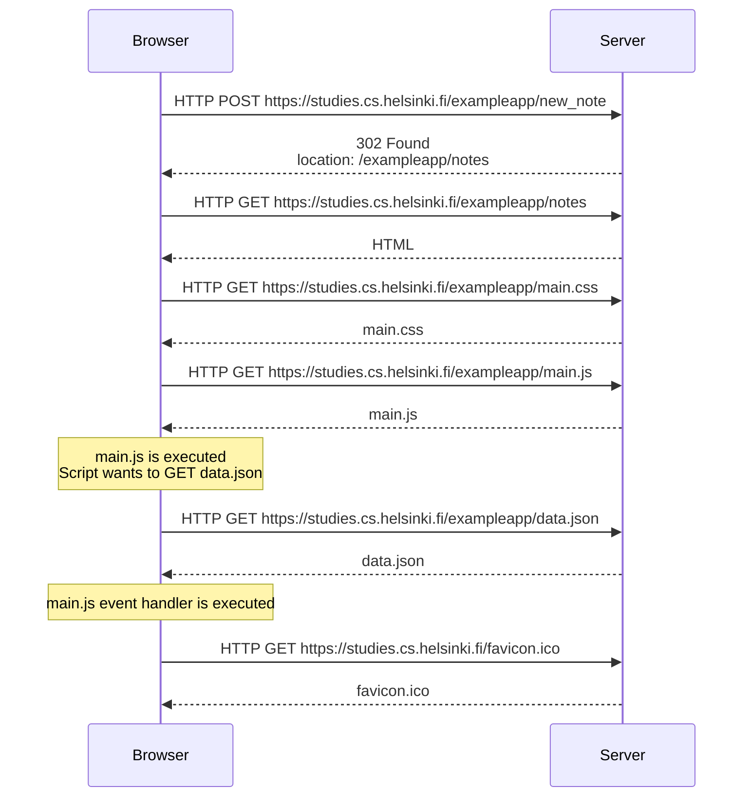

```mermaid
sequenceDiagram

participant B as Browser
participant S as Server

B ->> S: HTTP POST https://studies.cs.helsinki.fi/exampleapp/new_note
S -->> B: 302 Found <br>location: /exampleapp/notes


B ->> S: HTTP GET https://studies.cs.helsinki.fi/exampleapp/notes
S -->> B: HTML

B ->> S: HTTP GET https://studies.cs.helsinki.fi/exampleapp/main.css
S -->> B: main.css

B ->> S: HTTP GET https://studies.cs.helsinki.fi/exampleapp/main.js
S -->> B: main.js

Note over B: main.js is executed<br>Script wants to GET data.json

B ->> S: HTTP GET https://studies.cs.helsinki.fi/exampleapp/data.json
S -->> B: data.json

Note over B: main.js event handler is executed

B ->> S: HTTP GET https://studies.cs.helsinki.fi/favicon.ico
S -->> B: favicon.ico
```