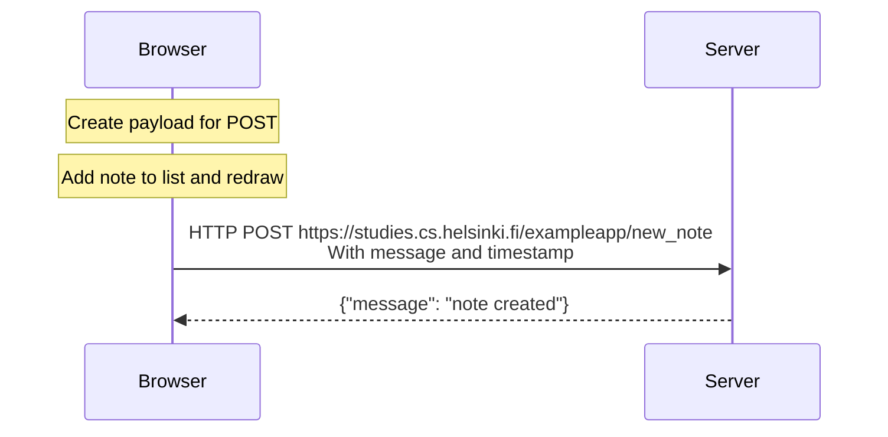

```mermaid
sequenceDiagram

participant B as Browser
participant S as Server

Note over B: Create payload for POST
Note over B: Add note to list and redraw
B ->> S: HTTP POST https://studies.cs.helsinki.fi/exampleapp/new_note<br>With message and timestamp
S -->> B: {"message": "note created"}
```